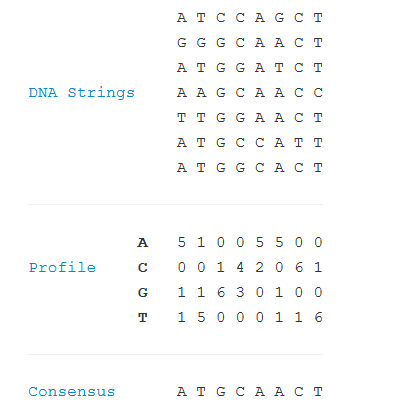

# Consensus and Profile

## Finding the Most Likely Common Ancestor

In “Counting Point Mutations”, we calculated the minimum number of symbol mismatches between two strings of equal length to model the problem of finding the minimum number of point mutations occurring on the evolutionary path between two homologous strands of DNA. If we instead have several homologous strands that we wish to analyze simultaneously, then the natural problem is to find an average-case strand to represent the most likely common ancestor of the given strands.

## Problem

A matrix is a rectangular table of values divided into rows and columns. An m×n matrix has m rows and n columns. Given a matrix A, we write Ai,j to indicate the value found at the intersection of row i and column j.

Say that we have a collection of DNA strings, all having the same length n. Their profile matrix is a 4×n matrix P in which P1,j represents the number of times that 'A' occurs in the jth position of one of the strings, P2,j represents the number of times that C occurs in the jth position, and so on (see below).

A consensus string c is a string of length n formed from our collection by taking the most common symbol at each position; the jth symbol of c therefore corresponds to the symbol having the maximum value in the j-th column of the profile matrix. Of course, there may be more than one most common symbol, leading to multiple possible consensus strings.

